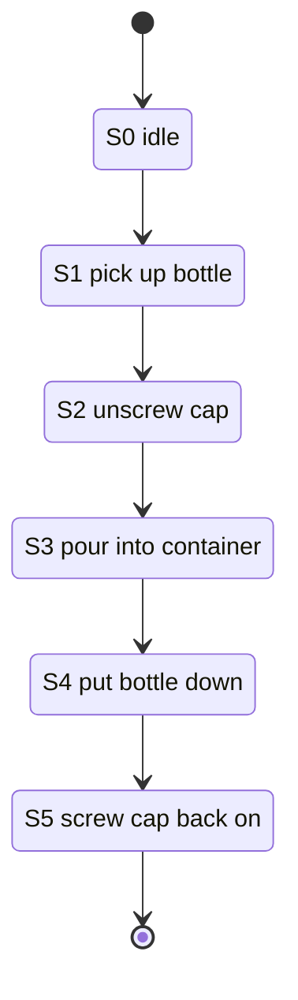
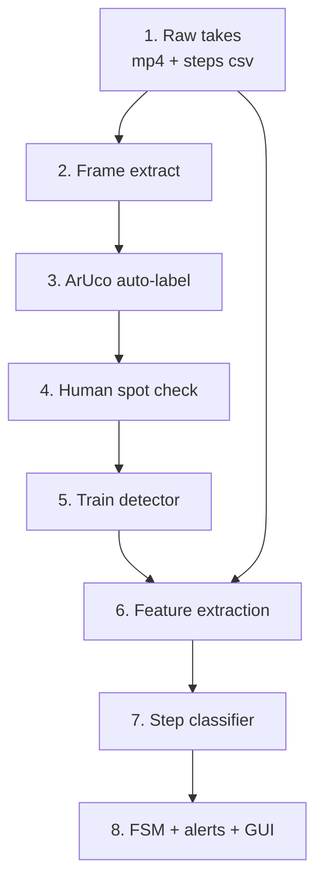

# Actus: Getting to Stage 2 (Dataset + Recording Plan)

2026-09-21 · @Someone

## The short version

This is the plan for going from "we have three scripts that prove the camera works" to "we have a dataset and a model that watches someone pour water."

Quick answers up front:

**Immediate next step:** stop writing perception demos and start building the recording tool. In order: calibrate the camera, write `configs/step_graph.yaml`, then write `tools/record_take.py`, which is a recorder that lets you tap number keys while filming to mark when each step starts. That one tool means our footage comes out already labelled in time, which is normally the most painful part of this whole thing.

**Markers:** we already have ArUco `DICT_4X4_50` ids 0 to 3 sitting in `markers/` and a tuned detector in `marker_test.py`. Nothing needs inventing. We just need to print them at the right physical size and stick them on properly.

**How many markers:** not one. Four. One marker on the bottle cannot tell the difference between "cap is screwed on" and "cap is off," and that difference is basically half the experiment. Full reasoning further down, it is the most important correction in this doc.

**Recording:** fixed camera on a tripod, never handheld, 1280x720 at 30fps, roughly 45 to 60 takes across three or four rooms, including deliberately wrong takes where someone skips a step.

One thing to keep repeating to ourselves: the markers are a **labelling crutch, not part of the final product**. We use them to generate training labels for free. The model we actually ship learns what a bottle and a cap look like, and at demo time there are no markers anywhere in the room. If we end up with a model that only works when it can see a marker, we have built nothing.

## Where we are right now

We have a working perception toolbox and zero data. That is the whole situation in one sentence.

What already runs:

| Thing | File | Status |
| --- | --- | --- |
| Threaded camera capture, drop-oldest queues, auto reconnect | `src/io/video_source.py` | Done, nothing consumes it yet |
| YOLO11m detection on live feed | `src/perception/detect_test.py` | Done, stock COCO weights only |
| MediaPipe 33-point pose | `src/perception/pose_test.py` | Done |
| Both together, serial, with a timing HUD | `src/perception/combined_test.py` | Done, 28.2 FPS compute ceiling |
| ArUco detection with tuned params and pose axes | `src/perception/marker_test.py` | Done |
| Printable markers, ids 0 to 3, 720x720 PNG | `markers/` | Done |
| Speed benchmarks | `sanity_checks/` | Done |

What does not exist yet:

- No step graph. `configs/` is empty apart from a `.gitkeep`, and the README already admits `step_graph.yaml` is not written.
- No recording. Nothing writes video to disk. `VideoSource` was built to fan out to a disk writer that we never wrote.
- No camera calibration. `marker_test.py` uses a made-up pinhole guess for intrinsics, so every distance and pose axis it draws is decorative, not measured.
- No custom detector. YOLO is running stock COCO weights, so it knows "bottle" (COCO class 39) and "cup" (41) and has no idea what a bottle cap is.
- No FSM, no GUI, no logging, no streaming. `src/fsm/`, `src/gui/` are empty folders.
- No dataset, obviously.

Also, minor housekeeping: the working tree has five modified files (the `pick_device()` MPS fallback) and one untracked file (`requirements-infer-macos.txt`) that are not committed yet. Commit those before anyone starts branching off, otherwise the Mac and Windows setups drift apart.

## Immediate next step from this repo

Five files, in this order. Do not skip ahead, each one feeds the next.

**1. `tools/calibrate_camera.py` plus `configs/camera_<name>.yaml`**

Print a checkerboard (9x6 inner corners, 25mm squares is standard), wave it around in front of the recording camera, grab about 20 good frames, run `cv2.calibrateCamera`, dump the camera matrix and distortion coefficients to YAML. Takes an afternoon.

Why first: `marker_test.py` currently fakes its intrinsics, and every marker-derived number (how far the cap is from the bottle, is the bottle tilted) depends on real ones. Also, calibration is per camera **and** per resolution, so it has to happen before we shoot anything, not after. If we record 50 takes and then calibrate with a different resolution, the takes are still usable for appearance but the geometry is junk.

**2. `configs/step_graph.yaml`**

The list of steps, what each one requires, what counts as done. This is the contract that the recorder, the labelling tool, the FSM and the GUI all read. Written once, everything else points at it. Details in the next section.

**3. `src/io/recorder.py`**

A `VideoSource` subscriber that writes frames to disk. Needed twice over: we need it to capture the dataset, and "store the video locally" is one of the problem statement's actual deliverables, so this is not throwaway code. Writes an `.mp4` plus a sidecar `.json` with resolution, fps, camera name, start timestamp.

**4. `tools/record_take.py`** (this is the important one)

The thing we actually run while filming. It shows the live feed, records to disk, and while recording, whoever is operating presses a number key when each step begins. `1` when the hand touches the bottle, `2` when the cap starts turning, and so on. The tool writes `take_017.mp4` plus `take_017_steps.csv` with the frame number and timestamp of every keypress.

Why this matters so much: the alternative is recording 50 videos and then sitting through all of them afterwards scrubbing to find where each step begins. That is roughly 50 takes times 6 steps times a minute of faffing, so several hours of extremely boring work that we would do badly. Pressing a key while it happens is close to free and more accurate, because the person operating watched it happen live. We can fix up the boundaries later with a small review pass.

It also needs: a countdown before recording starts, a key to abort and delete a bad take, an on-screen reminder of which step the keys map to, and a big obvious indicator of which step it thinks we are in.

**5. `tools/make_markers.py`**

Regenerates the marker PNGs at a specified physical size and lays them out on an A4 PDF with exact millimetre sizing and printed labels underneath. The current PNGs in `markers/` are 720x720 with no size information, so if someone prints them "fit to page" they come out at whatever size the printer felt like. We need to know the real width in millimetres or the pose estimation lies to us.

After those five, we go and film. Everything after filming (auto-labelling, training, FSM) comes later and is covered further down.

## The task, written as a step graph

The task we agreed on: person picks up a water bottle, unscrews the cap, pours water into a container, puts the bottle down, screws the cap back on.

That is six states once you include "nothing happening yet":



It is a straight line, which is good. Straight lines are easy to validate. Anything that is not the next arrow is either a skip, an out of order step, or nothing at all.

The bit that makes this a real design decision is what each step's **done condition** is, because that is what the model has to detect. Rough first pass:

| Step | Starts when | Done when | What tells us |
| --- | --- | --- | --- |
| S1 pick up bottle | hand comes within a few cm of the bottle | bottle has moved up off the surface | bottle box moves, wrist landmark is near it |
| S2 unscrew cap | both hands on bottle, one on the cap | cap and bottle are separate objects in the frame | cap stops being a `cap_on` and becomes a `cap_off` |
| S3 pour | bottle tilts past roughly 45 degrees, opening over the container | bottle returns upright | bottle orientation, bottle over container in image space |
| S4 put bottle down | bottle starts descending | bottle stationary on the surface, hand releases | bottle box stops moving, wrist moves away |
| S5 screw cap back on | cap approaches the bottle mouth | cap and bottle are one object again | `cap_off` goes back to `cap_on` |

Notice how many of those rows depend on knowing whether the cap is on or off, and on where the cap is when it is off. That is the whole argument for the marker layout in the next two sections.

`configs/step_graph.yaml` should hold, per step: an id, a short name, the voice prompt text to speak when this step becomes the next one, the required predecessor, a minimum plausible duration (to reject a one-frame flicker), and a maximum duration after which the system says "are you stuck." Keep the done conditions out of the YAML for now, they belong in code, but the YAML is what the GUI and the voice alerts read from.

## Designing the markers

We are not designing anything from scratch. ArUco `DICT_4X4_50` is already picked, already generated, already detected by tuned parameters in `marker_test.py`. What is left is the boring physical stuff that actually decides whether this works.

### Why 4x4 is the right dictionary here

A 4x4 marker has a 4 by 4 grid of data cells plus a one cell black border, so 6 cells across in total. Bigger dictionaries (5x5, 6x6) hold more unique ids and are more robust to bit errors, but each cell gets smaller for the same printed size, which means they need to be physically bigger or closer to the camera to decode. We need 4 ids, not 50, and one of our markers is going on a bottle cap that is about 30mm wide. 4x4 is the right trade.

### How big to print them

This is the part people get wrong. Work it backwards from pixels.

Rule of thumb: an ArUco marker needs to span roughly **40 pixels** in the frame to decode reliably. It will sometimes decode at 20 to 25, but "sometimes" is useless when we are auto-generating labels from it.

At 1280x720 with a typical webcam (about 60 degrees horizontal field of view), the frame is roughly 1.15 metres wide at a 1 metre distance. So:

```latex
\text{pixels per mm} = \frac{1280}{1150} \approx 1.11
```

So a 40mm marker at 1 metre is about 44 pixels. That works. Same marker at 2 metres is 22 pixels, which is on the edge of failing. Conclusion: **keep the camera at 1 to 1.5 metres from the action**, and size markers accordingly.

| Marker | Suggested size | Why |
| --- | --- | --- |
| Bottle body | 40mm | Big enough to survive at 1.5m, small enough not to cover the whole label |
| Cap | 20mm | Physically constrained by the cap being about 30mm wide |
| Container | 40mm | Same logic as the bottle |
| Table anchor | 60mm | It never moves and it is often furthest from the camera, so make it big |

The 20mm cap marker is the risky one. At 1 metre it is about 22 pixels, which is marginal. Mitigations: keep the camera closer for takes where the cap matters, or use a wider cap (a sports bottle cap or a 2L bottle cap is 40mm plus), or accept that the cap marker drops out sometimes and interpolate across the gaps during labelling.

### Printing rules

- **Print at exact scale.** Turn off "fit to page" and "scale to fit." Measure the printed marker with a ruler afterwards and write the real number down. If the print came out 38mm instead of 40mm, we use 38 in the config.
- **Matte paper, not glossy, and do not laminate.** Lamination looks professional and produces a mirror that blows out under any ceiling light. Plain paper is better.
- **Keep the white quiet zone.** The detector needs white space around the black border, at least one cell's worth (so about 7mm on a 40mm marker). Do not trim right up to the black edge. This is the single most common reason a marker stops detecting.
- **True black, not grey.** Draft mode printing gives a washed out grey that the adaptive threshold struggles with.
- Print spares. They get wet, they get creased, someone pours water on one.

### Mounting rules

- **Flat, always.** A round bottle curves the marker and the detector fits a quadrilateral to a shape that is no longer a quadrilateral. Either use a bottle with a flat panel, or cut a small piece of thin card, stick the marker to that, and tape the card on so it sits flat across the curve. The card wins.
- **Same place every take.** If the bottle marker is 5cm from the base in take 3 and 12cm in take 4, every offset we compute from marker to object box is wrong. Mark the position with a pencil line and reuse it.
- **Two markers, same id, opposite sides of the bottle.** The bottle rotates when it is picked up and poured, and a single face disappears. Putting the same id on the front and back means one of them is nearly always visible. When both show up in one frame, our labelling script just takes the one with the larger area. This does not count as a second marker in the budget below, it is the same id twice.
- **Tape all four edges down.** A corner that lifts catches light and kills the corner refinement.

### What breaks them, for the record

From the notes already in `marker_test.py`: motion blur (a hand moving a bottle fast is genuinely blurry at 30fps), glare, being too far, the quiet zone getting cropped, and being partly covered by a hand. That last one is unavoidable and is exactly why we interpolate over gaps rather than requiring every frame to have a detection.

## How many markers, and where

**Short answer: four ids, not one.** One on the bottle is not enough, and here is why.

A marker gives you three things: an identity, a position, and an orientation. If the only marker is on the bottle, then for every frame you know where the bottle is and how it is tilted. That covers S1 (pick up) and S3 (pour, because tilt is exactly what orientation gives you) and S4 (put down).

It tells you nothing at all about S2 and S5, which are the unscrewing and the screwing back on. Think about what the frames look like. Bottle sitting there, hand on top of it, bottle sitting there with a cap next to it. The bottle marker is in the same place in all three. The cap is a separate physical object that moves independently, so it needs its own identity, otherwise the system literally cannot see the difference between "cap on" and "cap off," and two of our six steps become invisible.

There is a second gap too. S3 is "pour into a container." The bottle marker tells you the bottle is tilted, but tilted over what? Someone tilting a bottle over the sink and someone tilting it over the beaker look identical if the beaker is not tracked. The container needs a marker so we can check the bottle mouth is actually above it.

And a third, softer one: everything above is measured in image pixels, which change the moment someone nudges the tripod between takes. A marker taped to the table that never moves gives us a fixed reference frame, so "bottle is 20cm above the table" stays true regardless of where the camera ended up. This also happens to be the honest first step toward the problem statement's optional orientation-agnostic requirement, where the astronaut's position is tracked relative to the payload rack rather than the floor. Our table anchor is a cheap stand-in for the rack.

### The marker budget

| Id | Goes on | Size | Job |
| --- | --- | --- | --- |
| 0 | Bottle body, flat card, same id on front and back | 40mm | Where is the bottle, is it tilted |
| 1 | Top face of the cap | 20mm | Is the cap on the bottle or somewhere else |
| 2 | Side of the target container | 40mm | Is the pour going into the right thing |
| 3 | Flat on the table, out of the way, never moves | 60mm | Fixed reference frame |

Four ids, five printed markers (because id 0 is printed twice, front and back of the bottle). We already have PNGs for exactly ids 0 to 3, so nothing new needs generating beyond resizing them properly.

### The clever bit about the cap marker

Because markers give orientation and not just position, we can compute the distance and relative rotation between marker 0 and marker 1. When the cap is screwed on, that relationship is fixed and small. When the cap is off, the distance grows and the rotation goes wherever. So "is the cap on" becomes a simple threshold on the distance between two markers, and the S2 and S5 boundaries drop out of the geometry nearly for free.

That is also what lets us auto-generate two different class labels for the detector, `cap_on` and `cap_off`, without a human ever drawing a box. More on that in the pipeline section.

### What if we only had one

We would have to hand-label S2 and S5 by scrubbing through every take, which is exactly the work we are trying to avoid. Three extra bits of printed paper is a very cheap way to buy that back.

## How to record the video

### Record with our own code, not with a phone

This is the rule that matters most and it is the one people ignore. Film through `tools/record_take.py`, using the same camera and the same settings the demo will use.

Why: a model trained on 4K iPhone footage with iPhone colour processing will do noticeably worse on a grainy 720p webcam feed. The technical name is domain gap and it is the single most common way student vision projects fall over on demo day. If the training footage and the demo footage come out of the same sensor at the same resolution with the same compression, that entire class of problem disappears.

It also means the step keypresses get recorded in the same file as the frames, which is the whole point of building the tool.

### Camera setup

- **Tripod, fixed, never handheld.** The problem statement says "fixed-payload cameras," so handheld footage is not representative of the real thing anyway. If we do not have a tripod, a stack of books is fine, just do not touch it during a take.
- **1 to 1.5 metres from the action**, framed so the table surface, the bottle, the container and the person's upper body are all in frame. Pose estimation needs to see shoulders and head, not just hands.
- **Height roughly at chest level**, angled slightly down. Vary this between takes but keep it fixed within a take.
- **1280x720, 30fps, MJPG.** MJPG matters. The repo README already flags that the camera negotiates uncompressed YUY2 by default, which caps 720p at about 7fps. The capture code already requests MJPG, so just do not remove that.
- **Do not move the camera mid-take.** If it gets bumped, abort and redo.

### What to vary, and what not to

Vary as much as possible, because this is what teaches the model to generalise instead of memorise:

| Vary | Keep constant |
| --- | --- |
| Room (messy bedroom, clean room, office, kitchen) | The step sequence itself |
| Lighting (daylight, ceiling light, lamp, dim) | Marker positions on the objects |
| Who is performing it (as many people as we can get) | Resolution, fps, codec |
| Clothing, especially long vs short sleeves | Which id means which object |
| Left vs right handed execution |  |
| Bottle type (different sizes, colours, labels) |  |
| Container type (mug, glass, beaker, bowl) |  |
| Speed (slow and deliberate, normal, rushed) |  |
| Camera angle, height and distance between takes |  |
| Background clutter and things moving in the background |  |

The messy bedroom is genuinely valuable, not a joke. Clutter is what breaks detectors, and having clutter in training means the model learns to ignore it.

### How many takes

**45 to 60 takes, each 30 to 60 seconds.** That gives roughly 30,000 to 50,000 frames total, of which we will sample maybe 3,000 to 5,000 for detector training.

Break it down as:

- **35 to 40 correct runs**, spread across all the rooms and variations above. This is the bulk.
- **8 to 12 deliberately wrong runs.** This is the part everyone forgets. The system has to detect skipped and out of order steps, and we cannot evaluate that capability without footage of skipped and out of order steps. Specific ones to shoot: pour without unscrewing first (dramatic and obvious), unscrew then put the bottle down without pouring, screw the cap on before putting the bottle down, walk away mid task and come back, do the steps in reverse order.
- **3 to 5 junk runs.** Person walks past and does nothing. Person picks up the bottle and drinks from it instead of pouring. Hands in frame doing something unrelated. These teach the system not to hallucinate a step starting.

### The per-take routine

1. Set the scene, place the markers, check the framing on the live preview.
2. Check all four markers are being detected before you hit record. `marker_test.py` is already the tool for this, run it first for ten seconds.
3. Hit record. Stay still for 2 seconds before anything happens.
4. Perform the task. The operator presses `1` to `5` as each step begins.
5. Stay still for 2 seconds at the end, then stop.
6. If anything went wrong, abort and redo it. Bad takes are worse than no takes.

The 2 second pads at each end matter because they give us clean examples of the idle state, and because they stop step boundaries landing on the very first or last frame.

### Naming and the take log

Files go into `raw_videos/` (already git-ignored, good) as `take_XXX_<room>_<actor>_<outcome>.mp4`. For example `take_017_bedroom_A_correct.mp4` or `take_042_office_B_skip_s2.mp4`.

Alongside, one CSV covering everything, `raw_videos/takes.csv`:

```csv
take_id,file,room,actor,lighting,bottle,container,camera_dist_m,outcome,notes
017,take_017_bedroom_A_correct.mp4,bedroom,A,lamp,500ml_blue,white_mug,1.2,correct,
042,take_042_office_B_skip_s2.mp4,office,B,ceiling,1L_clear,glass,1.4,skip_s2,poured without unscrewing
```

Fill it in as you shoot, not afterwards. Nobody remembers on Tuesday what the lighting was on Saturday.

### Budget roughly a full day

Fifty takes at a minute each is under an hour of actual footage, but setup, moving rooms, redoing bad takes and printing new markers eats the rest. Plan a day, bring more than one person.

## Shooting on a phone as well

Yes, we can, and `VideoSource` already supports it with basically no work. But the reason to do it is not really the generalisation one. The better reason is below.

### Getting the phone in as a camera

| Route | Phone | How it shows up | Verdict |
| --- | --- | --- | --- |
| Continuity Camera | iPhone XR or newer, macOS Ventura or newer | Just appears as another camera index | Best option if we have an iPhone and the Mac. Zero setup, no app, no wifi config |
| IP Webcam (free app) | Android | MJPEG over an http URL | Best Android option. `cv2.VideoCapture("http://<phone-ip>:8080/video")` |
| DroidCam, Camo, EpocCam | Either | Virtual webcam, shows up as a camera index | Works, but needs a driver installed on the laptop, and the free tiers watermark or cap resolution |
| Larix Broadcaster | Either | RTSP URL | More faff, but real control over bitrate and resolution. Overkill for us |

I checked the venv's OpenCV build and both FFMPEG and AVFoundation are compiled in, so network URLs and Continuity Camera both work already. Nothing to install.

### The code already handles this, with one bug to fix

`VideoSource.__init__` types `src` as `int | str` and hands it straight to `cv2.VideoCapture`, so this works today:

```python
VideoSource(src="http://192.168.1.7:8080/video")
```

One real problem though. The backend picker does this:

```python
backend = cv2.CAP_DSHOW if platform.system() == "Windows" else cv2.CAP_ANY
```

DirectShow is a local capture API and cannot open a URL. So on the Windows machine a network source will just fail to open, and the reconnect loop will sit there retrying forever with a confusing log line. Fix is to pick the backend off the type of `src`: FFMPEG when it is a string that looks like a URL, DSHOW only for an integer index on Windows.

Also worth knowing: on a network stream, `width`, `height` and `CAP_PROP_FOURCC` are all decided by the phone app and our `cap.set()` calls quietly do nothing. Set them in the app, and have the recorder log what it actually received rather than what it asked for.

### The generalisation argument is only half right

There are two goals pulling against each other here:

- **Domain diversity:** more varied cameras means a more robust model.
- **Domain match:** training footage that looks like deployment footage scores best on deployment footage.

With a few thousand frames, diversity still costs us specificity even on a mid-sized model like YOLO11m. If half the training set is 4K iPhone footage with Apple's colour processing and aggressive sharpening, the model spends some of its limited capacity learning that look, and none of that helps on the grainy 720p webcam the demo actually runs on. The problem statement says fixed payload cameras, so on demo day there is exactly one camera that matters.

So mix, but weight it. Roughly **70 percent webcam, 30 percent phone**, and the test set stays 100 percent webcam. If the phone footage turns out to help the webcam test numbers, push the share up. If it does not, we lost nothing, because of the next bit.

### The actual reason to use the phone

**Run both cameras at the same time, on the same take.**

One performance, two viewpoints, and one set of step keypresses covers both of them because they share a timeline. That gets us:

- Double the frames per take, for zero extra filming time
- Two genuinely different angles on the identical action, which is the hardest kind of variation to get any other way
- No extra labelling cost, since the step boundaries are shared and the ArUco auto-labeller runs per stream regardless
- Insurance, because if someone's body blocks the webcam view during a pour, the other angle still has it

Fifty takes turns into a hundred clips. That is a much bigger win than the domain diversity thing, and it is the reason to do this.

### What we have to get right for two cameras

1. **Sync them with a clap.** Phone frames come over wifi with 100 to 300ms of latency, so they get timestamped when they arrive at the laptop, not when they were captured. That offset is roughly constant for a given setup, so measure it: clap once in view of both cameras at the start of every take, find the clap frame in each stream afterwards, and the difference is the offset. It is the old film slate trick and it is still the best one.
2. **Record real per-frame timestamps, not assumed fps.** Wifi drops frames unevenly, so frame index times 1/30 is not the time. `Frame` already carries a `timestamp`, so `recorder.py` should write a timestamp sidecar per stream and never trust the container's fps.
3. **Downscale the phone feed to 1280x720 on the way in.** No point training on 4K frames that the deployment camera cannot produce. Set it in the app if the app allows it, resize in the recorder if not.
4. **Watch the webcam preview when pressing the step keys, not the phone one.** We are already about 250ms late from human reaction time. Reacting to a laggy preview stacks the stream latency on top of that.
5. **Wifi will be the annoying part.** Both devices on 5GHz, and do not try this on campus wifi with forty other devices on the AP. A hotspot off one of the laptops is more reliable.

### The obvious caveat

The phone never appears in the demo path. It is a data collection tool only. The deliverable is an offline standalone system running on one machine with a fixed camera, so nothing we ship can depend on a phone being on the network.

One bonus though: the phone is a good way to shoot the marker-free test takes, since those need to look different from the training set anyway.

## From footage to a working system

This is the part that answers "how exactly does that happen." Eight stages. Each one takes the previous one's output.



### 1. Raw takes land in `raw_videos/`

Output of the filming day. Each take is an mp4, a steps CSV from the keypresses, and a row in `takes.csv`. Git-ignored, so these live on a shared drive, not in the repo. Agree on where **before** the shoot, not after.

### 2. Frame extraction, `tools/extract_frames.py`

Pulls still frames out of each video and writes them as jpgs plus a manifest linking each frame back to its take and its frame number.

Two different sample rates for two different purposes:

- **For the detector: 2 to 3 frames per second.** Consecutive frames at 30fps are nearly identical, so training on all of them is wasted compute and inflates our validation scores with near-duplicates.
- **For the step classifier: all 30fps.** Temporal models need the actual motion, so keep the full clips.

### 3. ArUco auto-labelling, `tools/autolabel_aruco.py`

The money stage. For each extracted frame:

1. Run ArUco detection using the tuned parameters already in `marker_test.py`.
2. For each marker found, convert its four corners into a bounding box for the object it is attached to. This needs a fixed offset per marker, measured once: "marker 0 sits 60mm above the bottle base, the bottle extends 90mm left, 90mm right, 180mm up." Encode those in `configs/marker_objects.yaml`.
3. Compute the distance between marker 0 and marker 1 to decide `cap_on` versus `cap_off`, and write the cap's class accordingly.
4. Write a YOLO format label file per frame: `<class> <x_center> <y_center> <width> <height>`, all normalised 0 to 1.
5. Frames where a marker is missing (hand in the way, motion blur) get the box interpolated from the frames either side, as long as the gap is short. Long gaps get skipped entirely rather than guessed.

Classes come out as: `bottle`, `cap_on`, `cap_off`, `container`. Four classes.

The trick worth restating: we get thousands of labelled boxes out of this without anyone drawing a single one by hand. A human labelling 3,000 frames by hand is a week of misery. This is an afternoon of scripting.

### 4. Human spot check

The auto-labels will be wrong sometimes. Marker slipped, offset was measured badly, interpolation smeared across a real movement.

So: render the boxes onto a random 10 percent sample, flick through them, and fix what is broken. If more than about 5 percent look wrong, the problem is systematic (a bad offset in the config) and we fix the config and re-run rather than hand-correcting. CVAT or Label Studio on the training machine is fine for the fixing, but honestly a script that shows the frame and lets you press `y` or `n` catches most of it.

### 5. Train the detector

Fine-tune YOLO11m on our four classes, starting from the COCO weights we already have in `yolo11m.pt`. Standard Ultralytics training run, maybe 100 epochs, on the Windows CUDA machine, not the Mac.

Why fine-tune instead of training from scratch: COCO already taught it what edges, textures and object-ness look like. We only have a few thousand frames, nowhere near enough to learn that from nothing.

**Crucially, the markers are visible in the training frames.** The network will absolutely notice that a black and white square predicts a bottle, because that is the easiest possible shortcut. Two defences: random erasing augmentation that blanks out patches (which sometimes removes the marker and forces it to look elsewhere), and a validation set recorded **without markers at all**. Ten or so marker-free takes, hand-labelled, that exist purely to prove the model has not cheated. If accuracy craters on those, we know exactly what happened.

Output: `models/detector/best.pt`, which slots straight into the existing `detect_test.py` path.

### 6. Feature extraction, `src/perception/features.py`

Now the temporal part. For every frame of every take, run the trained detector and MediaPipe pose, and boil the result down to one modest feature vector:

- Detector: per class, whether it is present, its box centre, its box size, its confidence.
- Pose: the wrist, elbow, shoulder, hip and nose landmarks, expressed relative to the table anchor rather than raw pixels.
- Derived: distance from each wrist to the bottle, distance from each wrist to the cap, distance from the bottle to the container, bottle tilt angle, is the bottle above the container, cap on or off.
- Motion: how much each of the above changed over the last few frames.

Maybe 60 to 80 numbers per frame. Cache these to disk as npy arrays, because recomputing them every time we tweak the classifier is agonisingly slow.

This is the stage that makes everything downstream cheap. The step classifier never sees pixels, only this vector, so it trains in seconds and runs in microseconds.

### 7. Step classification, `src/fsm/`

Take the per-frame feature vectors plus the step boundaries from the recording keypresses, and learn to predict which step is happening.

Start simple and only escalate if it is not good enough:

1. **Hand-written rules on the features first.** Genuinely. "Bottle tilt over 45 degrees and bottle centre above container centre" is a pour detector, and it might just work. Rules are debuggable, need no training data, and make an excellent baseline to beat.
2. If rules are too brittle, a small **temporal model** over a sliding window of about 2 seconds (60 frames). A 1D CNN or a small LSTM over the feature vectors. This is a tiny model because the features are already low-dimensional.
3. Smooth the output over time so a single noisy frame does not trigger a step transition.

### 8. FSM, alerts, logging, GUI

The classifier says "I think we are in step 3." The FSM decides what that means: is it the expected next step, a skip, an out of order step, or noise to ignore. It then fires the voice alert through pyttsx3 (already in requirements), writes the timestamped line to the log file, and updates the GUI.

All four of the problem statement's remaining deliverables (voice alerts, structured text log, stream plus local storage, monitoring GUI) hang off this stage, and none of them are hard once the step detection works. Do not start them before the step detection works.

## Splitting the data so we do not fool ourselves

One rule, and it is not optional: **split by take, never by frame.**

If you shuffle all the frames and take 20 percent for validation, then frame 400 is in training and frame 401 is in validation. They are nearly the same picture. The model scores 99 percent and it has learned nothing. This is the classic way video projects convince themselves they work and then fail live.

So, split whole takes:

| Split | Share | What goes in it |
| --- | --- | --- |
| Train | about 70 percent | Mixed across all rooms and actors |
| Validation | about 15 percent | Whole takes held out, used for tuning |
| Test | about 15 percent | **One entire room never seen in training**, plus the marker-free takes |

That test split is deliberately harsh. Holding out a whole room means the test set answers the real question, which is "does this work somewhere it has never been," and that is exactly what a demo is. If it scores well on the office when it only ever trained on bedrooms and clean rooms, we are in genuinely good shape.

Write the split out as a file, `configs/splits.yaml`, listing take ids per split. Do not regenerate it randomly each run, or numbers stop being comparable between experiments.

## Things that will bite us

- **The model learns the markers.** Covered above, but it is the number one risk, so it gets repeated. Marker-free validation takes are the only real defence. Shoot them on the same day, do not put it off.
- **Water and paper.** We are pouring liquid next to printed markers. Sleeve the markers in a sandwich bag, or just accept reprinting a few.
- **Real water on real electronics.** Consider doing some takes with an empty bottle and miming the pour, since the visual is nearly identical and nothing gets wet. Do enough real ones that it looks right in the demo.
- **The cap marker is small and gets covered by a hand exactly when it matters.** Unscrewing means a hand is wrapped around the cap. Interpolation over gaps handles most of it, but expect this to be the flakiest signal.
- **Camera permissions on Mac.** Already noted in the repo README. The first run prompts, and if someone dismisses it the camera silently fails. If a script opens and shows nothing, check System Settings before debugging code.
- **Recording and inference at the same time is slow.** The combined pipeline already sits at 28 FPS compute ceiling. Adding an encoder on the same machine will slow it down. `VideoSource` already fans out on independent queues with drop-oldest, which is the right design, but still measure it rather than assuming.
- **We have two machines with different pins.** Windows CUDA and Mac MPS have genuinely different requirements files for real reasons (mediapipe 1.x crashes on Mac, opencv 5 conflicts with numpy). Anything new goes in **both** files, or it works for one person and not the other.
- **Step boundaries from keypresses are approximate.** Human reaction time is about 250ms, so keypresses land a bit late and drift consistently in one direction. Either subtract a fixed offset, or let the temporal model's smoothing absorb it. Just be aware the labels are not frame-exact.
- **Do not build the GUI early.** It is the most visible piece and therefore the most tempting. It is also worthless without working step detection. Build it last, build it quickly.

## Checklist

In order. Nothing here blocks on anything below it.

**Before filming**

- [ ] Commit the working tree (the `pick_device()` changes and `requirements-infer-macos.txt`)
- [ ] Agree where `raw_videos/` actually lives, since it is git-ignored
- [ ] Write `configs/step_graph.yaml` with the six steps
- [ ] Write `tools/calibrate_camera.py`, print a checkerboard, calibrate at 1280x720, save `configs/camera_*.yaml`
- [ ] Write `tools/make_markers.py`, print ids 0 to 3 at 40 / 20 / 40 / 60mm on matte paper, plus a second copy of id 0
- [ ] Measure the printed markers with a ruler and record the real sizes
- [ ] Mount them: card behind the bottle markers, top of the cap, side of the container, flat on the table
- [ ] Measure the marker-to-object offsets and write `configs/marker_objects.yaml`
- [ ] Write `src/io/recorder.py`
- [ ] Write `tools/record_take.py` with the step hotkeys
- [ ] Do one throwaway test take end to end and check the CSV and mp4 both come out sane
- [ ] Fix the `VideoSource` backend picker so a URL source uses FFMPEG instead of DSHOW on Windows
- [ ] Get the phone streaming in (Continuity Camera, or IP Webcam for Android) and confirm `VideoSource` opens it
- [ ] Clap test both cameras once and measure the phone's constant latency offset

**Filming day**

- [ ] 35 to 40 correct takes across at least three rooms
- [ ] 8 to 12 deliberately wrong takes (skips, wrong order, abandonment)
- [ ] 3 to 5 junk takes
- [ ] About 10 marker-free takes for the honest test set
- [ ] Keep `takes.csv` filled in as you go
- [ ] Run both cameras on every take, and clap at the start of each one for sync

**After filming**

- [ ] `tools/extract_frames.py`
- [ ] `tools/autolabel_aruco.py`
- [ ] Spot check 10 percent of the auto-labels
- [ ] `configs/splits.yaml`, split by take, one room held out
- [ ] Fine-tune YOLO11m, evaluate on the marker-free takes
- [ ] `src/perception/features.py`
- [ ] Rules-based step detection as the baseline
- [ ] Temporal model only if the rules are not good enough
- [ ] FSM, then voice, then logging, then GUI

The first block is about two or three days of work for a couple of people. Filming is a day. Everything after that depends on how the data looks.
