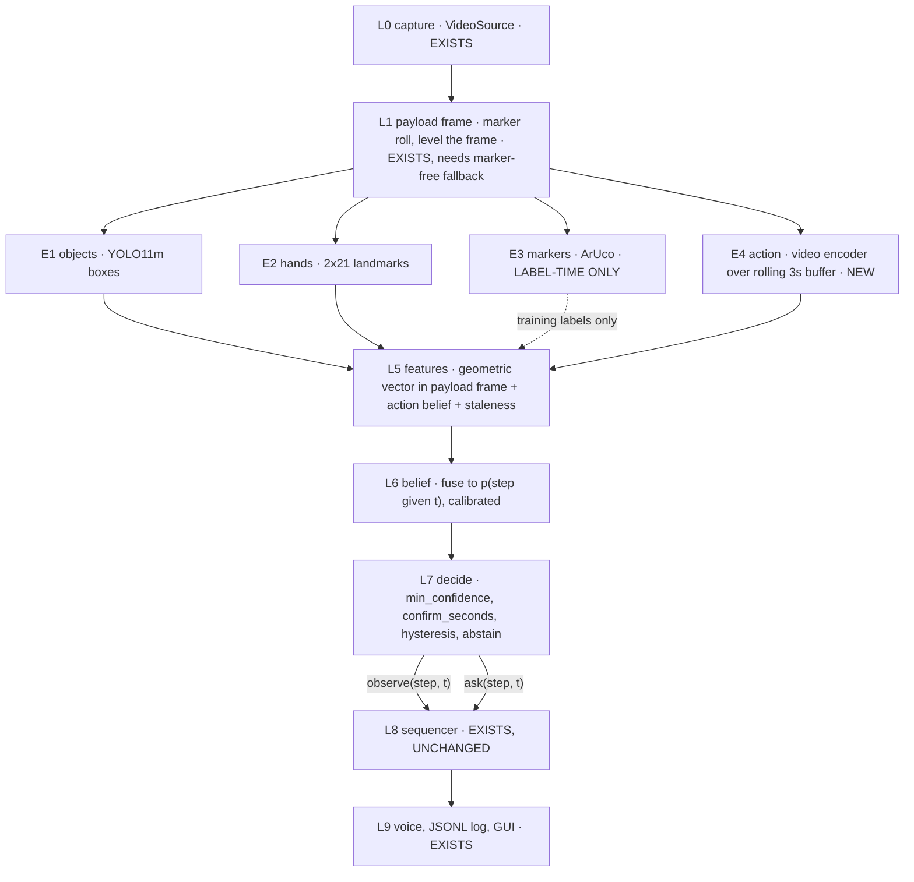

# ACTUS Stage 3: where a microgravity action model actually belongs

2026-09-26 · Architecture companion to `Stage2.md` (shoot plan) and `Stage3.md` (export protocol)

## The short version

Seven findings, in order of how much they change the plan. The first three come from reading
`har-bas/src/` rather than the docs, and they move the integration point.

**1. The FSM is not fabricated. Its input is.** `src/fsm/sequencer.py` is a real, tested,
227-line symbolic protocol checker: it accepts requirement-satisfying steps, flags skips
without advancing, flags out-of-order and too-fast steps, and raises `stuck` on timeout.
`tests/test_sequencer.py` covers it. What does not exist is the thing that turns pixels into
`seq.observe(step_id, t)` calls. `ScriptSource` and `HotkeySource` stand in for it — a human
at the number keys, or a CSV replaying a human who was at the number keys. That is the
fabricated part, and naming it precisely matters, because it tells us exactly where a new
model plugs in.

**2. The model goes *below* the FSM, not above it.** The brief says "an additional layer
above FSM." Invert that. The FSM is the judge; every model is a sensor. Nothing should be
able to override the protocol logic, because it is the one component we can actually
guarantee correct — it is deterministic and unit-tested, and it will still be correct on a
task we have not filmed yet. The action model's job is to produce better evidence, and the
sequencer should not learn that it exists. Concretely: **zero changes to `sequencer.py`.**
`sources.py` already says so in its own docstring: *"The trained classifier becomes a third
source later. The sequencer does not change."*

**3. The missing layer already has a name and a config, and nothing reads it.**
`configs/step_graph.yaml` declares `confirm_seconds: 0.35` ("a new step must hold this long
before it is believed") and `min_confidence: 0.50` ("per-frame classifier confidence below
this is ignored"). `step_graph.py` parses both into `StepGraph`. Grep says **nothing consumes
either one.** That is the debouncer, specified but unbuilt. It is the real hole in the
pipeline, it is independent of any model, and it can be built and tested this week.

**4. The blocker for MicroG-4M as specified in `Stage3.md`: there is no person in frame.**
`perception.py`'s own header records the measurement — the takes are framed on the table, so
the camera sees "forearms and hands and almost never a head or shoulders." BlazePose returned
a skeleton on 65% of take1's frames "but often a wrong one, e.g. drawn along the bottle
mid-pour," which is why the GUI overlays use the 21-point hand landmarker instead. MicroG-4M
is AVA-style spatio-temporal **person** detection: it RoI-pools features inside a person box,
and its published mAP is measured that way. `Stage3.md`'s plan to synthesise that box from
"shoulders, hips, wrists, nose" cannot run on this footage. This is a framing decision, it is
free to fix before the shoot and expensive after, and it is the single most important thing
in this document. Options in §4.

**5. The orientation win this model looked like it would buy is already bought more cheaply —
but the catch is the best argument for buying it anyway.** `perception.py` levels the frame
using a payload marker and measured that this fully repairs YOLO's collapse under rotation:
flipped take1 found the cup on 0/215 frames unlevelled versus 215/215 upright, and with
levelling "flipped and 90-degree-rotated take1 detect exactly as upright does." So
orientation-agnosticism is solved. But `PAYLOAD_MARKERS = (3, 0)` means it is solved **only
while a fiducial marker is visible at demo time** — and `Stage2.md`'s central rule is that
markers are a labelling crutch that must not exist in the shipped product. That contradiction
is live and unresolved in the current design. A video model that is orientation-robust without
a fiducial is the most defensible reason to add this layer. Note the honest framing: we are
not buying "microgravity understanding," we are buying "no fixed up, without a marker."

**6. Pouring cannot happen in microgravity, and the problem statement's own sample task does
not ask it to.** The ISRO text describes a box containing red and yellow boxes — pick, place,
translate. That is gravity-neutral and sits directly in MicroG-4M's existing vocabulary
(`36 lift/pick up`, `17 carry/hold object`, `47 put down`). Our bottle-pour task needs two
brand-new class IDs precisely *because* it is an Earth-only action. Recommendation in §6: keep
pour as the built demo, add the box task as a second protocol.

**7. Cut the AVA export from the critical path.** `Stage3.md`'s `export_microg_format.py`,
the `label_map.pbtxt` surgery and the CSV/`frame_list` plumbing only pay off for Path B, the
fine-tune — the slowest and weakest path, on ~50 takes, across a domain gap we cannot predict.
A clip slicer in our own three-column schema is an hour of work. AVA format compliance is a
week of yak-shaving for an ablation we may never run. Build it in Phase 5 if the gate passes.

**What does not change:** `Stage2.md`'s rig, distances, marker sizes, variation matrix, take
log and split-by-take rule; `Stage3.md`'s slow-deliberate-action amendment, its isolated
calibration clips, and its insistence that MicroG-style tags are *not* step numbers.

## 1. Corrections: the docs have drifted from the code

The code is authoritative. Fix these in `Stage2.md` and `Stage3.md` before anyone shoots.

| # | Docs say | Code says | Consequence |
|---|---|---|---|
| 1 | `S4` = put bottle down, `S5` = screw cap back on (`Stage2.md` step table, `Stage3.md` mapping table) | `step_graph.yaml`: `s4` = screw cap back on, `s5` = put bottle down | `Stage3.md`'s step→action_id mapping is **wrong for s4 and s5 as written**. It would tag every screw-on window as `47 put down`. |
| 2 | Marker 0 = bottle, 2 = container (`Stage2.md` marker budget) | `perception.py`: `{0: container, 1: cap, 2: bottle, 3: table}`, with an explicit comment that this is *not* Stage2's plan | Stage2's size assignments follow the wrong object. The 40 mm sizing logic is fine; the ids need swapping. |
| 3 | BlazePose body landmarks; features built on "wrist, elbow, shoulder, hip and nose" (`Stage2.md` §6, `Stage3.md` person-box section) | Hand landmarker, 2 × 21 points, for measured reasons | The whole feature-vector spec needs rewriting around hand landmarks. See finding 4. |
| 4 | "Nothing has been filmed yet" (`Stage3.md`) | `takes/take1_steps.csv` is a real 984-frame / 32.8 s take, plus an error take; `perception.py`'s timing and rotation numbers are measured on them | One take exists. What is fabricated is the *outputs* — `demo/*.csv` are hand-authored step scripts, not model predictions. |
| 5 | FPS table in `Stage2.md` / `har-bas/README.md` | Both flagged stale (YOLOv8n era). Current: YOLO ~21 ms GPU, hands ~20 ms CPU, markers ~3 ms, ~25 ms/frame with YOLO and hands concurrent, on the RTX 4070 | Any compute budget for the new layer must start from ~25 ms/frame, not the old 35.4 ms serial figure. |

Also: every MicroG-4M fact in this document (4,759 clips, 50 classes, I3D-NLN 47.12% mAP,
Slow 4×16 28.72% F1, PySlowFast checkpoints) is **inherited from `Stage3.md` and not
independently verified.** The Phase 0 spike verifies them by running the thing.

## 2. The re-modelled architecture

Eight layers. The new one is L4. Everything from L6 down already exists and is untouched.



Read the two things that matter off that diagram:

- **E3 is a dashed line that stops at training.** ArUco produces labels and nothing else.
  If any solid arrow from E3 reaches L7 at demo time, we have shipped the crutch. The one
  place this is currently violated is L1 (see §5).
- **L7 has two outputs, not one.** `observe` and `ask`. That second one is free money and
  neither Stage2 nor Stage3 uses it — see §3.

### The contract between L5 and L7

Freeze this in Phase 0 so the geometric stream and the action stream can be built in parallel
by different people. Sketch, not final:

```python
@dataclass(frozen=True)
class StepBelief:
    t: float                      # video timeline, same clock the sequencer uses
    p: dict[str, float]           # step id -> probability, sums to 1 over graph.steps
    source: str                   # "rules" | "geom" | "action" | "fused"
    age: float                    # seconds since the evidence behind this was captured
```

`age` is not decoration. E4 runs at 2–4 Hz (§7) while E1/E2 run at ~30 Hz, so most frames
carry a stale action belief. A stale belief must decay out of the pool rather than silently
dominating it; without an age field that bug is invisible and will present as the system
confidently announcing a step one second late, every time.

### Fusion: late, log-linear, calibrated — before anything learned

With ~50 takes, do not concatenate a 2048-d embedding onto 70 geometric features and train a
head. Start with a log-linear opinion pool over per-stream posteriors:

```
log p_fused(s) ∝ w_geom · log p_geom(s) + w_action(age) · log p_action(s)
```

Two weights, tuned on validation, `w_action` decaying with `age`. Reasons: it is the only
option that fits the data budget; it makes the ablation grid in §8 clean, because dropping a
stream is setting one weight to zero; and it keeps the system debuggable, which a fused
black box does not.

**Temperature-scale each stream on the validation split before pooling.** An uncalibrated
pool is dominated by whichever stream is more overconfident, which is a property of its
training, not its correctness. This is ten lines of code and skipping it invalidates every
number in §8. Escalate to a learned GRU/TCN head over `[geometric ⊕ PCA-16(embedding)]` only
if Phase 3 shows the pool leaving signal on the table.

## 3. The abstain path is the prize, and it already exists

`step_graph.yaml` gives every step a `question` ("Is the cap off?"). `Session.ask()`,
`Session.answer()` and `Session._lapse()` are implemented: the system says *"I can't see
clearly. Is the cap off?"*, waits, counts the step from when it asked on a yes, repeats the
instruction on a no, and lapses the question if events move on. `takes/take1_unsure_steps.csv`
already exercises it end to end.

So the decision layer has a third option besides "right" and "wrong": **ask.** That reframes
what L6 has to produce. An argmax is not enough; we need a *calibrated* confidence, because
the abstain threshold is only meaningful if the probability means something.

It also changes what "good" looks like. A system that abstains on 5% of steps and is right on
the rest beats one that guesses and is wrong on 15% — in this application by a wide margin,
because the abstention costs an astronaut one spoken word and the error costs a failed
experiment. Measure it explicitly (§8, abstain rate). This is the strongest existing asset in
the repo that neither planning doc exploits.

### Debouncer spec (L7)

1. **Gate:** ignore any belief whose max probability is below `min_confidence` (0.50).
2. **Dwell:** a new step must hold the argmax for `confirm_seconds` (0.35 s) before it is
   observed. Prevents the one-frame flicker `sequencer.py` is already defensive about.
3. **Hysteresis:** leaving the active step requires a higher margin than entering a new one.
   Without this, a belief oscillating around the boundary emits alternating `observe` calls,
   and `sequencer.py` will faithfully report each one as out-of-order — the alerts flap and
   the astronaut stops trusting the voice.
4. **Abstain:** if the top-2 probabilities are within a margin for longer than
   `confirm_seconds`, or the expected next step's probability is rising but never clears the
   gate, call `session.ask(expected_step)` instead of guessing.
5. Emit `graph.idle` when nothing clears the gate, which is how `sequencer.py` closes an
   active step.

Add `hysteresis_margin` and `ask_margin` to `step_graph.yaml` beside the two existing knobs.

## 4. Decide the framing before the shoot

Finding 4 is a fork, and the shoot day forecloses it. Three options:

| Option | What it does | Cost |
|---|---|---|
| **(a) Widen the framing** to include head and shoulders | Makes the person-centric path viable as published | Objects shrink in pixels, and `Stage2.md`'s entire marker-size budget is derived from pixels-per-mm at 1–1.5 m. Widening pushes the 20 mm cap marker below the ~40 px decode threshold — it **trades the ArUco auto-labeller for the action model.** Bad trade. |
| **(b) Drop the RoI head, use the backbone as a clip encoder** — global-pooled features over the whole frame, no person box at all | Keeps the learned representation, discards the published detection head we cannot feed anyway | Loses the published mAP number as a reference point. We were never going to reproduce it on our task regardless. **Recommended first experiment.** |
| **(c) Hand-landmark bbox as a pseudo-person box** | Cheapest to implement | A full-body-trained RoI head fed a forearm crop is out of distribution. Expect the published head's outputs to be close to meaningless. Do not lead with this. |
| **(a′) Two framings, one shoot** | Near camera for markers and objects, wide camera for the action model | **Resolves the fork without choosing.** `Stage2.md` already plans a second camera (phone) and already specifies clap-sync and a shared keypress timeline, so both views inherit the same labels for free. Marginal cost on the day: near zero. |

Take **(a′) for capture and (b) for the first model.** Capture both framings so the choice
stays open; run the encoder as a clip encoder first because it is the only option whose input
assumptions we actually satisfy.

## 5. The unresolved contradiction: markers in the deployment path

`Stage2.md`: markers are a labelling crutch, *"at demo time there are no markers anywhere in
the room,"* and *"if we end up with a model that only works when it can see a marker, we have
built nothing."*

`perception.py`: `PAYLOAD_MARKERS = (3, 0)` — the fixed table and container markers tell the
detector which way is up, and *"when neither marker is visible the last known orientation is
kept."*

Both are reasonable. Together they are a contradiction, and it needs an explicit decision
rather than a footnote, because the optional HMR requirement in the problem statement is
exactly this question. Three honest answers:

1. **Accept the marker as payload furniture.** The problem statement says the astronaut is
   tracked "relative to the payload rack" — a fiducial permanently fixed to a rack is a
   legitimate engineering answer, not a cheat, provided we say so plainly. It is *not* a
   marker stuck on the manipulated object, which is what Stage2 rightly bans.
2. **Estimate roll without a fiducial** — a small orientation regressor, or simply run the
   detector at four 90° rotations and keep the most confident. The brute-force version costs
   4× detector time and needs measuring against the 25 ms/frame budget.
3. **Use an orientation-robust video encoder** so L6 degrades gracefully when L1 has no
   reference. This is the argument for E4 that survives scrutiny.

My recommendation: (1) as the shipped answer, stated openly, with (3) measured as the
evidence that the system is not *dependent* on it. Test it with the rotation stress runs in
§8 on takes where **no marker is present at all** — note that `Stage2.md`'s marker-free test
takes are not sufficient here if ids 3 and 0 stay on the table for levelling.

## 6. Add a second, gravity-neutral protocol

Pouring is the wrong task to make a microgravity claim about. Liquid does not pour in orbit;
the real procedure uses a syringe or a pouch. That is also *why* `Stage3.md` has to invent
class IDs 201 and 202 — the action is Earth-only, so no microgravity-trained vocabulary
contains it.

The problem statement's own sample experiment — a box containing red and yellow boxes — is
pick, place and translate. Gravity-neutral, and already covered by `17 carry/hold object`,
`36 lift/pick up` and `47 put down`.

`sequencer.py` is task-agnostic: it reads the graph and nothing else. A second protocol costs
one more `step_graph.yaml` and one more set of takes. What it buys:

- The microgravity story becomes honest instead of decorative.
- Zero label-map surgery, so **Path B becomes cheap** — fine-tuning on an existing vocabulary
  rather than a 52-class extension.
- It demonstrates the system generalises across protocols, which is the actual deliverable
  ("a pre-defined experiment," not "this bottle").
- It matches what the evaluators described.

Keep pour as the built, filmed, working demo. Add the box task as protocol two.

## 7. Compute and the kill risk

E4 is a 3D CNN over a 90-frame buffer. Do not run it per frame.

- **Rate:** 2–4 Hz, on its own thread, via `VideoSource`'s existing drop-oldest fan-out
  (already designed for exactly this). Hold the last belief with its `age`.
- **Budget:** the frame loop is at ~25 ms with YOLO and hands concurrent. A Slow 4×16 R50
  clip is on the order of 50–150 ms on the 4070. At 3 Hz that is 15–45% of one core's worth
  of GPU time — plausible, but **measure it, do not assume it.**
- **Kill risk:** PySlowFast is CUDA-oriented and effectively unmaintained against torch
  2.14. There may be no MPS path at all, which means the video head either runs only on the
  Windows box or needs an ONNX/CoreML export. The deliverable is *"a trained AI model that
  runs on offline standalone system"* — if E4 cannot run offline on the demo machine within
  budget, **the layer is dead regardless of how much accuracy it would add.**

This is why the Phase 0 spike is first. It is roughly one day and it can save the whole
effort. Nothing else in this plan should start until it returns a number.

## 8. Will it actually help? — the falsifiable version

"Adds extra signal" is untestable. Here is the per-step prediction, made in advance.

| Step | Geometric evidence | Weakness | E4 plausibly helps? |
|---|---|---|---|
| s1 pick up bottle | bottle box rises, hand near it | strong and unambiguous | **No** — expect no gain |
| s2 unscrew cap | `cap_on` → `cap_off` | a hand wraps the cap, hiding the exact signal. `Stage2.md` already calls this the flakiest signal in the system | **Yes** — a twisting motion signature survives the occlusion that hides the cap |
| s3 pour | bottle tilt > 45°, over container | the threshold assumes a world "up"; "tilted and holding" vs "tilted and pouring" are geometrically identical | **Yes** — pouring is a dynamic, not a pose |
| s4 screw cap back on | `cap_off` → `cap_on` | same occlusion as s2 | **Yes** |
| s5 put bottle down | box descends, hand releases | strong | **No** |
| rotated / no marker | needs a payload marker to level | fails outright without one | **Yes — the strongest case** |

So the prediction is specific: E4 buys s2, s3, s4 and orientation robustness, and buys nothing
on s1 and s5. **If the measured gain is not concentrated there, it is noise and the layer gets
dropped.** A diffuse small gain across all six steps is the signature of a leak, not a win —
most likely overlapping-window leakage across the train/val boundary.

### Metrics — define before the shoot, because they constrain what the recorder captures

| Metric | Why this one |
|---|---|
| **Step-boundary F1 at ±0.5 s** | Primary. "Suggest the next step" depends on boundaries, not on per-frame labels. |
| **Segmental edit distance** on the predicted step sequence | Catches the failure the FSM cares about: right steps, wrong order. |
| **Skip recall / precision** on the deliberately-wrong takes | Report both, **weight recall**. A missed skip is a failed experiment; a false alarm is an irritated astronaut. |
| **False alarms per minute** on junk takes | The takes where nothing should fire. Guards against a model that hallucinates steps. |
| **Onset latency** — true step start → `started` event | What the astronaut actually feels. `sequencer.py` already timestamps this. |
| **Abstain rate** | §3. A system that asks 5% of the time and is otherwise right beats one that guesses and is wrong 15%. |
| Per-frame accuracy | Report it, do **not** optimise it. Least aligned with what the FSM needs. |

Remember `Stage2.md`'s own warning: keypress labels land ~250 ms late from human reaction
time, consistently in one direction. Subtract a fitted constant offset before scoring boundary
F1, or every latency number inherits it.

### Ablation grid, with the gate pre-registered

| Run | Streams |
|---|---|
| **B0** | Hand-written rules on geometric features. **Must exist before E4 is judged.** |
| **B1** | Learned temporal head on geometric features |
| **B2** | B1 + E4 frozen-encoder belief, late fusion |
| **B3** | E4 alone |
| Stress | Each of the above on (i) marker-free takes, (ii) takes rotated 90/180° in post, (iii) occlusion-heavy takes |

**Gate:** B2 ships only if it beats the better of B0/B1 on **boundary F1 or skip recall** on
the held-out room, without raising the false-alarm rate — *or* if it is the only configuration
that survives the rotation stress test with no marker present. Otherwise it is dropped and the
writeup says so. Write this gate down before Phase 3 starts; the temptation to keep the layer
because it is the interesting part of the report is the main threat to an honest result.

### Bake off encoders — do not be monogamous about MicroG-4M

Same harness, one flag, three checkpoints:

| Encoder | What it tests |
|---|---|
| MicroG-4M fine-tuned (I3D-NLN or Slow 4×16) | The hypothesis |
| **Same architecture, Kinetics-400 only** | **The control.** Isolates what microgravity tuning actually bought. |
| A modern general encoder (VideoMAE-v2 ViT-B or similar) | R50-era checkpoints are several years old; a stronger general encoder may beat a weaker specialised one |

The middle row is the one that answers the research question. Without a Kinetics control, a
MicroG-4M win proves nothing about microgravity — it proves only that video features help,
which we would have expected anyway. That single extra run is what makes this a finding
instead of an anecdote.

## 9. Shoot amendments

**Keep from `Stage3.md`:** slow, deliberate s2/s3/s4 in 8–10 of the correct takes (a 3 s
window needs the action to span it); 10–15 isolated single-action calibration clips; strict
split-by-take, extended to windows — two overlapping windows from one take must never land on
opposite sides of a split.

**Drop from `Stage3.md`:** the `label_map.pbtxt` 201/202 extension and AVA CSV export as
pre-work (Phase 5 if the gate passes); the `60 turn screwdriver` proxy for cap-twisting — it
is a semantic stretch and `Stage3.md` already half-concedes it.

**Add — all cheap now, expensive after:**

1. **Two framings on every take** (near for markers and objects, wide for the action model),
   sharing one keypress timeline and the clap sync `Stage2.md` already specifies. Resolves §4
   without choosing.
2. **A handful of genuinely rolled-camera takes** (45°, 90°, 180°), plus rotate-in-post for
   the rest. Needed to test L1's marker-free fallback.
3. **Takes with no markers at all**, not merely no object markers. `Stage2.md`'s marker-free
   test takes keep ids 3 and 0 on the table for levelling, which invalidates the rotation
   test. Shoot some completely bare.
4. **No-table takes** — bottle held in the air, handed between people, performed against a
   vertical surface. The closest Earth proxy for "no surface to put things on," and the honest
   way to test any gravity-neutrality claim.
5. **The second protocol** (§6): the ISRO red/yellow box task.
6. **Occlusion-heavy takes** — body between camera and hands, deliberately, since that is the
   condition E4 is hypothesised to rescue.

## 10. Build order

**Phase 0 — before the shoot (~2 days, de-risks everything)**

- [ ] **Spike:** does a published MicroG-4M checkpoint load and run at all, on either machine?
      Record ms/clip on CPU, MPS and CUDA. **Kill criterion:** no offline path on the demo
      machine within budget → stop, and write up why.
- [ ] Verify the `Stage3.md` MicroG-4M facts against the paper and the HF repos while doing it.
- [ ] Freeze the L5→L7 contracts (`StepBelief`, staleness) so both streams proceed in parallel.
- [ ] **Build L7, the debouncer, against a fake belief source**, wire `StepClassifierSource`
      beside `ScriptSource`/`HotkeySource`, and unit-test it by replaying `demo/*.csv` through
      it as synthetic beliefs. This closes the pipeline before any model exists and turns the
      fabricated demo into a real one driven by real plumbing. **Highest value per hour in
      the whole plan.**
- [ ] Wire `confirm_seconds` and `min_confidence` to something; add `hysteresis_margin` and
      `ask_margin`.
- [ ] Fix the five drift rows in §1.
- [ ] Decide §5 explicitly and record the decision.

**Phase 1 — shoot.** `Stage2.md`'s plan plus the six amendments in §9.

**Phase 2 — geometric baseline.** Auto-label with ArUco, fine-tune the detector, build
`features.py` on **hand** landmarks, then B0 rules and B1. This must exist before E4 is judged;
without a baseline, "it helps" is unfalsifiable.

**Phase 3 — E4.** Frozen clip encoder, linear/GRU probe, the three-way bake-off, late fusion
with per-stream temperature calibration. Run B2 and B3 plus all stress variants.

**Phase 4 — the gate.** Keep or drop, per §8. Write up which, either way.

**Phase 5 — only if Phase 4 keeps it and time allows.** AVA-format export, the 52-class
`label_map.pbtxt`, and the fine-tune-vs-Kinetics-init ablation from `Stage3.md`'s Path B.

## 11. Risks

- **PySlowFast against torch 2.14 / MPS.** Kill risk. Phase 0, first.
- **The person-box assumption** (§4). Mitigated by capturing two framings.
- **Demo-time compute.** The frame loop is already at ~25 ms. Measure, do not assume.
- **~50 takes is thin** for anything beyond a frozen-encoder probe. This is the honest reason
  Path B stays an ablation.
- **Overlapping-window leakage.** 1 s hop on a 3 s window means adjacent windows share two
  thirds of their frames. Split by take, never by window. A suspiciously uniform gain across
  all steps is the symptom.
- **Markers in the deployment path** (§5). Needs a decision, not a footnote.
- **Sunk-cost bias toward keeping E4** because it is the interesting part of the writeup.
  The pre-registered gate in §8 is the only defence, and it only works if it is written down
  before the numbers come in.
