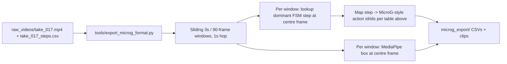

# ACTUS × MicroG-4M: Recording and Labelling Protocol

2026-09-25 · Companion to `Stage2.md`

## The short version

We are **not** shooting a second dataset from scratch for this. We are adding one export
script, `tools/export_microg_format.py`, that reslices the takes Stage 2 already tells us
to film (`raw_videos/take_XXX.mp4` + `take_XXX_steps.csv`) into MicroG-4M's exact clip /
keyframe / bounding-box / CSV format, and extends its 50-class action vocabulary by two
IDs instead of forking it. That gives us, for free:

- A dataset shaped so we can warm-start a PySlowFast fine-tune from the published
  MicroG-4M checkpoint instead of raw Kinetics-400, as a cheap ablation.
- The ability to run the published MicroG-4M model **zero-shot, no training at all**,
  and drop its per-clip action scores into `features.py`'s feature vector as extra
  signal for the step classifier.
- A dataset that stays a strict superset of a published, citable benchmark, which is
  useful for the writeup regardless of which path we take.

**What this document is not:** a way to make MicroG-4M's model output "next step" or
"skipped step." It can't. It classifies short, independent 3-second clips with no
notion of order. That job stays with our own FSM (`src/fsm/`), fed by the object
detector, MediaPipe, and now optionally this too.

**The one-sentence rule if you remember nothing else:** MicroG-4M labels *what a person
is generically doing* (`lift/pick up`, `carry/hold object`, `turn screwdriver`). Our
step CSV labels *which step of our specific protocol* is happening. Never write S0–S5
into a MicroG-style CSV, and never expect a MicroG-style tag to tell you the step number.

## Nothing has been filmed yet — three amendments to fold into Stage 2's plan

This document was originally written as if a shoot already existed to reuse. It doesn't
yet, which is good news — these are cheap to bake into the filming plan now and
expensive to fix by re-shooting later. Nothing else about Stage 2's plan changes: same
rig, same distance, same markers, same two-camera setup, same variation matrix, same
take log. Three additions only:

1. **Give S2, S3, and S5 room to breathe in a meaningful fraction of takes.** A 3-second
   export window is labelled by whichever step covers its centre frame, but the
   classifier looks at the whole 3-second window, not just the centre. If a real pour
   takes 1 second, a window centred on it is mostly "tilted bottle before/after," not
   "pouring" — weak signal for exactly the class (`201 pour`) that has no existing
   MicroG-4M analogue to fall back on. Stage 2 already asks for slow/normal/rushed
   pacing across takes; the addition is just making sure a real subset — 8 to 10 of the
   35-40 correct takes is enough — perform S2, S3, and S5 unhurried enough to span
   close to 2-3 seconds. Normal and rushed takes stay valuable for the FSM itself; they
   just won't contribute much to the two new MicroG-style classes.
2. **Fold the calibration clips (see below) into the main shoot day**, not a later
   optional pass. With nothing filmed yet, this is just one more take-bucket alongside
   correct / wrong / junk: a handful of isolated, deliberately clean single-action
   clips (one pour, one twist, nothing else happening), same rig, same settings, shot
   back-to-back with everything else.
3. **Capture format doesn't change.** Stage 2's MJPG / 1280×720 / 30 fps stays exactly
   as specified. H.264 only appears when the export script slices out a 3-second clip
   with `ffmpeg` — a re-encode at export time, not a capture-side requirement.

## What MicroG-4M actually is (need-to-know facts)

Source: Wen, Qi, et al., *"Go Beyond Earth: Understanding Human Actions and Scenes in
Microgravity Environments,"* ICLR 2026. [Paper](https://arxiv.org/abs/2506.02845) ·
[GitHub](https://github.com/LEI-QI-233/HAR-in-Space) ·
[Dataset](https://huggingface.co/datasets/LEI-QI-233/MicroG-4M) ·
[Train-ready AVA-format dataset](https://huggingface.co/datasets/LEI-QI-233/MicroG-HAR-train-ready) ·
[Fine-tuned models](https://huggingface.co/LEI-QI-233/MicroG-4M-models). License: CC-BY-4.0
on annotations; raw source videos (real footage + film clips) are not redistributed —
users fetch them independently. That doesn't affect us since we're filming our own footage.

- **4,759 clips**, each exactly **3 seconds, 30 fps, H.264**, drawn from real ISS /
  Tiangong / EVA YouTube footage and a curated set of realistic space films (Apollo 13,
  etc.).
- **Task = spatio-temporal atomic action detection**, structured like Google's AVA:
  per clip, per detected person, up to 5 labels from a fixed 50-class vocabulary.
  Multi-label, not sequential.
- **50 action classes**, grouped into three macro-categories carried over from AVA:
  Object Manipulation, Person Interaction, Person Movement.
- **Annotation format**: person bounding boxes (pixel coordinates in the raw release,
  normalised 0–1 in the AVA-ready release) plus an `actions.csv` mapping
  `video_id, person_id → action_id`. A `label_map.pbtxt` (AVA format: `label_id`, `name`,
  `label_type`) maps IDs to names and macro-categories.
- **Keyframe convention**: the AVA-ready release replaces AVA's `middle_frame_timestamp`
  with `key_frame_stamp` — the index of the middle frame among whichever frames got a
  bounding box within that clip's 90-frame (3 s) window. We'll use the simpler, standard
  AVA convention instead (see below) — it's easier to reproduce deterministically and is
  what the training code expects by default.
- **Fine-tuned checkpoints** (PySlowFast weights, Kinetics-400-pretrained then fine-tuned
  on MicroG-4M): best test mAP is I3D-NLN (8×8, R50) at 47.12%; best F1 is Slow (4×16,
  R50) at 28.72%. These are the two worth trying first if we ever fine-tune.

## The 50-class vocabulary, and where our task actually overlaps it

Full list is in the paper's Table 9; the ones relevant to us:

| ID | Name | Category | Fires during |
|----|------|----------|---------------|
| 12 | stand | Person Movement | S0 idle |
| 36 | lift/pick up | Person Movement | S1 pick up bottle |
| 59 | touch object | Object Manipulation | S1, S2, S5 |
| 17 | carry/hold object | Object Manipulation | S1 through S5, whenever bottle is in hand |
| 45 / 46 | pull / push object | Object Manipulation | weak signal during the twist of S2/S5 |
| 60 | turn screwdriver | Object Manipulation | closest existing proxy for the cap-twisting motion in S2/S5 — a stretch, use as a coarse feature only |
| 47 | put down | Object Manipulation | S4 put bottle down |

**No class for "pour."** Checked the full list — it isn't there, and nothing else is
close enough to reuse honestly. Two genuinely new classes are needed:

| New ID | Name | Category | Covers |
|--------|------|----------|--------|
| 201 | pour (liquid, one container to another) | Object Manipulation | S3 pour |
| 202 | twist/rotate small handheld object (open or close) | Object Manipulation | S2 unscrew, S5 screw back on |

Two IDs, not one per direction — direction (opening vs. closing) is *not* this layer's
job. That distinction already belongs to the `cap_on` / `cap_off` object-detector classes
from Stage 2's YOLO fine-tune. Don't duplicate that signal here; it just adds label noise
for no benefit.

New IDs start at 201, safely clear of AVA's 1–80 space. Table 9's ID column already skips
numbers like 2, 4, 13, 15… — those are AVA action IDs MicroG-4M's curators excluded as
not applicable in microgravity (water-, ground-, or sport-specific actions). **Don't
reuse those gaps** for our new classes — it'll make anyone cross-referencing the published
label map think our clip is one of the excluded AVA actions. Fresh IDs above 80 avoid
that ambiguity entirely.

Append to `label_map.pbtxt` (grab the authoritative file itself from the
[HF dataset](https://huggingface.co/datasets/LEI-QI-233/MicroG-4M/blob/main/label_map/label_map.pbtxt)
rather than retyping all 50 — we only add these two entries at the end):

```
item {
  name: "pour (liquid, one container to another)"
  label_id: 201
  label_type: OBJECT_MANIPULATION
}
item {
  name: "twist/rotate small handheld object (open or close)"
  label_id: 202
  label_type: OBJECT_MANIPULATION
}
```

## The dataset format we must match

If there's any chance of loading this into PySlowFast_for_HAR later, match these
exactly — retrofitting a folder structure after the fact is far more painful than
producing it right the first time.

**Clip spec:** 3 seconds, 30 fps, H.264, MJPG source (same camera settings Stage 2
already mandates — nothing new to configure).

**Folder layout**, mirroring MicroG-4M's own (`movie/` and `real/` become our own
source tag):

```
microg_export/
 |_ actus/
 |  |_ take_017/
 |  |  |_ take_017_003.mp4      # seconds 9-12 of the take
 |  |  |_ take_017_004.mp4      # seconds 12-15, overlapping by design (see below)
 |  |  |_ ...
```

**Video naming**: `<take_id>_<window_index>.mp4`, where `window_index` is not
contiguous — same rationale as MicroG-4M's own naming (some windows get discarded:
straddling a room change, camera bump, etc.).

**CSV schema** (standard AVA convention, comma-separated, no header row expected by
PySlowFast — keep a headed copy alongside for humans, same as MicroG-4M's
`ava_with_head/` folder):

```
video_id, frame_timestamp, x1, y1, x2, y2, action_id, person_id
take_017_003, 1, 0.312, 0.184, 0.601, 0.912, 17, 1
take_017_003, 1, 0.312, 0.184, 0.601, 0.912, 36, 1
```

- `frame_timestamp` = 1 keyframe per clip, at the temporal centre (frame 45 of 90 at
  30 fps). This is the plain AVA convention — simpler than MicroG's
  median-of-annotated-frames rule and what the loader expects by default.
- `x1,y1,x2,y2` normalised 0–1, person bounding box (not the ArUco object boxes — see
  next section).
- One row per `(action_id, person_id)` pair — a clip with 3 simultaneous tags is 3 rows.
- `person_id`: for our single-actor takes this is always `1`; keep the column anyway,
  the loader expects it.

## Where the bounding box comes from — don't build a new tool for this

MicroG-4M gets person boxes from a YOLOv11 + tracker pipeline. We don't need that: we
already run MediaPipe pose on every frame (`pose_test.py`). Take the bounding rectangle
of the visible landmarks (shoulders, hips, wrists, nose — whatever MediaPipe reports
with confidence above threshold for that frame), pad it ~15% on each side, and that's
the person box for the keyframe. One function, no new detector, no new dependency.

## Where the clips and labels come from — reuse the shoot, don't duplicate it



Concretely, `export_microg_format.py` does this per take:

1. Slide a 90-frame (3 s) window across the take with a **1-second hop** (not
   non-overlapping — we want density, and unlike MicroG-4M we're not scraping
   independent YouTube clips, we're slicing one continuous performance).
2. For each window, look up which FSM step is active at the window's centre frame,
   using the same `take_XXX_steps.csv` the recorder already writes. If the window
   straddles two steps (centre frame lands within ~15 frames of a keypress), skip it —
   ambiguous windows are worse than missing windows, same logic as Stage 2's marker
   interpolation rule.
3. Look up the row in the mapping table above for that step, write the 1–3
   corresponding `action_id` rows.
4. Compute the person box from MediaPipe at the centre frame.
5. Write the clip (`ffmpeg -ss ... -t 3`), the CSV rows, and a `frame_list` entry.

**Expected yield:** 45–60 takes at 30–60 s each, minus the ~2 s idle pads Stage 2
already prescribes, at a 1 s hop, gives roughly 1,500–2,500 windows before any
filtering — the same order of magnitude as MicroG-4M's own 4,759 clips. Comfortably
enough for the auxiliary-feature path (no training needed at all); workable but thin
for a real fine-tune, which is one more reason to treat fine-tuning as an experiment,
not the plan.

**One consequence worth flagging now:** adjacent 1-second-hop windows overlap by two
thirds. That's irrelevant for the zero-shot auxiliary-feature path (cheap batched
inference, no training, no leakage risk). If we ever do fine-tune, split by **take**,
never by window — the same rule Stage 2 already states for frame-level splits, extended
one level up. Two overlapping windows from the same take must never land on opposite
sides of a train/val split.

## Precise instructions for the person running the export/QA pass

This is the part a person actually executes, once the script above exists.

1. Confirm `raw_videos/takes.csv` is filled in and every take has a matching
   `_steps.csv` — Stage 2's filming checklist should already guarantee this.
2. Run `export_microg_format.py` over the whole `raw_videos/` folder. It's fully
   automatic; nobody watches footage at this stage.
3. **Spot-check 10% of windows**, same discipline as the ArUco auto-labelling spot
   check in Stage 2: for a random sample, play the 3-second clip and read the assigned
   action IDs against the mapping table. You're checking two things —
   - Does the visible action plausibly match the assigned tag(s)?
   - Is the person box roughly on the person, not drifted onto the background or
     truncating a limb?
4. If more than ~5% look wrong, the problem is systematic — usually the step-boundary
   lookup window (step 2 above) is too permissive, or MediaPipe is losing the person
   during fast motion (bottle pours are quick). Fix the script, re-run, don't
   hand-correct one clip at a time.
5. Wrong or junk takes, wrong-order takes, and abandonment takes (already part of
   Stage 2's filming plan) still get exported — assign whatever the mapping table says
   for whatever step is genuinely visible in that window. A "poured without unscrewing"
   take still contains a real `201 pour` window; it's still useful here even though
   it's a negative example for the FSM.
6. File the exported set under `microg_export/` (git-ignored, same as `raw_videos/`) and
   note the export script's git commit hash somewhere alongside it — if the mapping
   table changes later, you need to know which export it applied to.

## Calibration clips: a handful of dedicated single-action takes

The reused-footage export will be noisy: real pours blur into holds, real unscrewing
blurs into holding, especially in normal/rushed-pace takes. ~10-15 short, deliberately
clean 3-second clips per new action ID (`201`, `202`) — filmed in isolation, one action,
nothing else happening, same camera/lighting rules as Stage 2 — are cheap insurance
against a classifier that never sees an unambiguous positive example. Same camera
setup as everything else; no new equipment. Since filming hasn't started, shoot these
as one more take-bucket on the same shoot day (see amendment 2 above) rather than
treating them as a later add-on.

## What to do with it once it exists

**Path A — zero-shot auxiliary feature (do this first, costs nothing):**
Run the published MicroG-4M checkpoint (I3D-NLN or Slow 4×16) directly over each
exported clip. Take the sigmoid scores for IDs 17, 36, 45, 46, 47, 59, 60 — the
manipulation-relevant subset — and append them to the per-frame feature vector in
`src/perception/features.py`. No training, no label QA beyond a light sanity check,
and it slots into the pipeline Stage 2 already designed without touching the FSM at all.

**Path B — fine-tune from the MicroG-4M checkpoint (treat as an ablation, not a
commitment):** Point PySlowFast_for_HAR's config at the extended `label_map.pbtxt`
(52 classes) and our exported CSVs, initialise from the MicroG-4M checkpoint instead
of raw Kinetics-400, and compare validation mAP against a Kinetics-400-initialised
run on the same data. Keep whichever wins. Given the Earth-vs-microgravity domain gap
discussed below, don't assume the MicroG-4M init wins — measure it.

## Honest risks and open questions

- **Domain gap is real and untested.** MicroG-4M is tuned specifically to correct
  Earth-gravity posture priors. Our footage is Earth-gravity. Whether its checkpoint
  helps or actively fights our detector is an empirical question we haven't answered —
  run the ablation in Path B before trusting it either way.
- **`turn screwdriver` (60) is a semantic stretch** for cap-twisting. It's the least
  reliable row in the mapping table. If Path A's feature turns out to be noise for S2/S5
  specifically, drop it rather than force it.
- **Window-boundary ambiguity** (step 2 of the export script) is the same class of
  problem as Stage 2's keypress-latency issue — expect some clips near a step
  transition to get mislabeled or skipped, and don't chase every last one.
- **This whole document only matters if Path A or B actually improves something
  measurable.** If the auxiliary features don't move the step classifier's accuracy,
  the honest move is to drop this integration and say so in the writeup, not keep it
  for its own sake.

## Checklist

**Before/during Stage 2 filming (new — see amendments above)**

- [ ] Plan for 8-10 of the correct takes to perform S2, S3, and S5 at an unhurried,
      deliberate pace (close to 2-3 seconds each), not just varied speed for its own sake
- [ ] Add ~10-15 isolated single-action calibration clips (pour only, twist only) as one
      more bucket on the shoot day, same rig and settings as everything else
- [ ] No changes to capture settings — MJPG, 1280×720, 30 fps, exactly as Stage 2 states

**Export pipeline (after filming)**

- [ ] Confirm `label_map.pbtxt` extension (201, 202) doesn't collide with anything —
      diff against the authoritative file from Hugging Face, don't retype it by hand
- [ ] Write `tools/export_microg_format.py` (sliding window, step lookup, MediaPipe box,
      CSV + frame_list writer)
- [ ] Run it once on a single already-filmed take, sanity-check the output CSV and clip
      by hand before running it on everything
- [ ] Run it on the full `raw_videos/` set once filming is done
- [ ] Spot-check 10% of exported windows
- [ ] (Optional) film 10–15 dedicated calibration clips for IDs 201 and 202 if the
      reused export looks thin on those two classes
- [ ] Path A: pull MicroG-4M checkpoint, run zero-shot, wire scores into `features.py`
- [ ] Path B (only if A looks promising or time allows): configure PySlowFast_for_HAR
      fine-tune from the MicroG-4M checkpoint vs. a Kinetics-400 baseline, compare
- [ ] Write up whichever path was kept — and say plainly if neither moved the needle